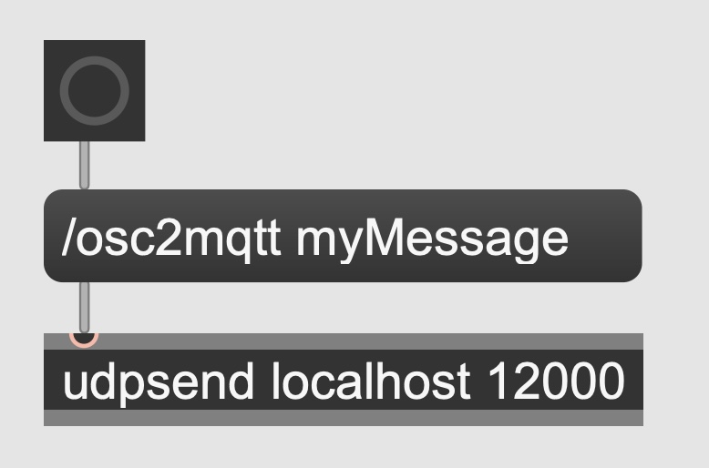

# simple_osc2mqtt

Super basic OSC to MQTT bridge that routes local OSC messages starting with "osc2mqtt" to a MQTT broker.

## Why?

I had a Max/MSP patch that needed to send MQTT msgs. As there is no native option and other solutions don't work on a silicon Mac computer, I decided to just build a quick and dirty bridge between OSC (via UDP on localhost) and MQTT.

## Installation

Other than dependencies (argparse, pythonosc, paho.mqtt, time) nothing needs to be installed or set up. 

## Usage

### Run

- Execute the python script by e.g. `python osc2mqtt.py`
- You will be asked 
  - to enter the port that the bridge should wait for incoming OSC messages
  - to enter the IP address of the MQTT broker (can be "loclahost")

### Run with Arguments

You can also add port and IP by using arguements (--port and --ip) when executing:

`python osc2mqtt.py --ip localhost --port 12000`

### Send Messages

- Now just send OSC messages to this port in this format:
  - `/osc2mqtt myMessage` or `/osc2mqtt 0.33 0.44 0.55` 
  - in max this can look like:

     
